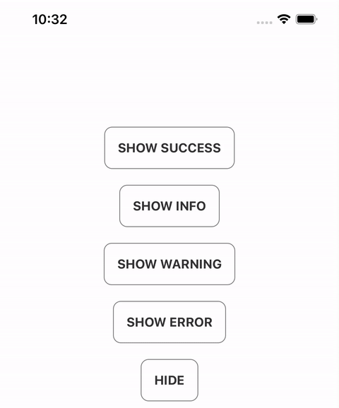

# @iqorlobanov/react-native-toast

Animated toast component for React Native.



## Documentation

- [Installation](#installation)
- [Usage](#usage)
- [API](#api)

## Installation

> This component created by using `react-native-reanimated` and `react-native-vector-icons`. Make sure you have installed [react-native-reanimated](https://docs.swmansion.com/react-native-reanimated/docs/fundamentals/installation) and [react-native-vector-icons](https://github.com/oblador/react-native-vector-icons#installation) before start.

```sh
yarn add @iqorlobanov/react-native-toast
# or
npm install --save @iqorlobanov/react-native-toast
```

## Usage

---

Render the ToastComponent in your app's entry file, as the **LAST CHILD** in the View hierarchy (along with any other components that might be rendered there):

```js
// App.tsx
import { ToastComponent } from '@iqorlobanov/react-native-toast';

export default function App() {
  return (
    <>
      {/* ... */}
      <ToastComponent />
    </>
  );
}
```

Then use it anywhere in your app (even outside React components), by calling any Toast method directly:

```js
// Foo.tsx
import { Toast, ToastType } from '@iqorlobanov/react-native-toast';
import { Button } from 'react-native';

export function Foo() {
  return (
    <Button
      title="Show toast"
      onPress={() => {
        Toast.show({
          title: 'Lorem Ipsum',
          description:
            'Lorem Ipsum is simply dummy text of the printing and typesetting industry.',
          type: ToastType.SUCCESS,
          visibilityTime: 5000,
        });
      }}
    />
  );
}
```

## API

---

The `Toast` API consists of:

1. [methods](#methods) that can be called directly on the `Toast` object
2. [props](#props) that can be passed to the `ToastComponent` component instance; they act as defaults for all Toasts that are shown

## methods

### `show(options = {})`

To show a Toast, call the `show()` method andd pass the `options` that suit your needs. Everything is optional, unless specified otherwise:

```js
import { Toast } from '@iqorlobanov/react-native-toast';

Toast.show({
  title: 'Lorem Ipsum',
  description:
    'Lorem Ipsum is simply dummy text of the printing and typesetting industry.',
  type: ToastType.SUCCESS,
  visibilityTime: 5000,
});
```

The complete set of **options** is described below:

| option           | description                                                             | required | type        | default value       |
| ---------------- | ----------------------------------------------------------------------- | -------- | ----------- | ------------------- |
| `type`           | Toast type. Available values of: `SUCCESS`, `INFO`, `WARNING`, `ERROR`. | `true`   | `ToastType` | `ToastType.SUCCESS` |
| `title`          | First line of text                                                      | `true`   | `string`    |                     |
| `description`    | Second line of text                                                     | `false`  | `string`    |                     |
| `visibilityTime` | Number of milliseconds after which Toast automatically hides.           | `false`  | `number`    | `5000`              |
| `topOffset`      | Offset from the top of the screen (in px). Has effect only when         | `false`  | `number`    | `10`                |
| `withShadow`     | Enable shadow effect                                                    | `false`  | `boolean`   | `true`              |
| `touchable`      | Hide toast on toch                                                      | `false`  | `boolean`   | `true`              |
| `showLeftIcon`   | Show left icon component                                                | `false`  | `boolean`   | `true`              |
| `showRightIcon`  | Show close icon component                                               | `false`  | `boolean`   | `true`              |

### `hide()`

To hide the current visible Toast, call the `hide()` method:

```js
Toast.hide();
```

## props

The following set of `props` can be passed to the `ToastComponent` component instance to specify certain **defaults for all Toasts that are shown**:

| prop                 | description                 | type              | default value |
| -------------------- | --------------------------- | ----------------- | ------------- |
| `titleStyle`         | Title text style            | `TextStyle`       |               |
| `descriptionStyle`   | Description text style      | `TextStyle`       |               |
| `style`              | Toast view style            | `ViewStyle`       |               |
| `leftIconComponent`  | Custom left icon component  | `React.ReactNode` |               |
| `rightIconComponent` | Custom right icon component | `React.ReactNode` |               |

```js
// App.tsx
import { ToastComponent } from '@iqorlobanov/react-native-toast';
import CustomRightIcon from './CustomRightIcon'

export default function App() {
  return (
    <>
      {/* ... */}
      <ToastComponent
        titleStyle={{
          fontSize: 16,
          color: 'black',
        }}
        descriptionStyle={{
          fontSize: 14,
          color: 'gray',
        }}
        rightIconComponent={<CustomRightIcon />}
      />
    </>
  );
}
```

## License

MIT
